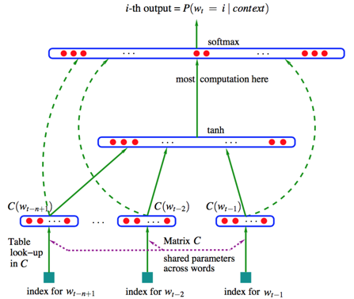

2013年，Google开源了一款用于词向量计算的工具--word2vec，引起了工业界和学术界的关注。
首先，word2vec可以在百万数量级的词典和上亿的数据集上进行高效地训练；其次，该工具得到的训练结果--词向量(word embedding)，
可以很好地度量词与词之间的相似性。随着深度学习（Deep Learning）在自然语言处理应用的普及，很多人误以为word2vec是一种深度学习
算法，其实word2vec只是一个浅层神经网络。当我们提到word2vec算法或模型时，指的是word2vec的CBOW模型和Skip-gram模型。

### word2vec的前世今生
其实训练词向量的模型有很多，如Ngram,Glove,word2vec。
对于Ngram模型，它的缺点非常明显，由于参数空间的爆炸式增长，它无法处理更长的context(N>3)，也没有开率词与词之间内在的联系性。例如，考虑
"the cat is walking in the bedroom"这句话。如果我们在训练语料中看到了很多类似"the dog is walking in the bedroom"或是"the cat is running
in the bedroom"这样的句子，那么即使我们没有看见过这句话，也可以从"cat"和"dog"之间的相似性，推测出这句话的概率，然而Ngram做不到。
原因就是，Ngram本质上是将词当作一个个孤立的原子单元（atomic unit）去处理的。这种处理方式对应到数学上的形式是一个个离散的one-hot向量（除了
一个词典索引的下标对应的方向上是1，其余方向上都是0）。例如对于一个大小为5的词典：{"I","love","the","nature","language","processing"},
"nature"对应的one-hot向量为：[0,0,1,0,0]。显然，one-hot向量的维度等于词典的大小。这在动辄上万甚至百万词典的实际应用中，面临着巨大的维度灾难问题

鉴于one-hot向量模型的不足，人们后来提出了NNLM(Neural Network Language Model，神经网络建立统计语言模型)，并首次提出了word embedding的概念。
NNLM模型可以拆分为两部分：
1. 首先是线性embedding层，它将输入的N-1个one-hot词向量，通过一个共享的DxV的矩阵C，映射为N-1个分布式的词向量(distributed vector)。其中，
V是词典的大小，D是embedding向量的维度，C矩阵里存储了要学习的word vector。
2. 其次是一个简单的前向反馈神经网络g。它由一个tanh隐层和一个softmax输出层组成。通过将embedding层输出的N-1个词向量映射为一个长度为V的概率分布向量，
从而对词典中的word在输入context下的条件概率做出预估。
NNLM的模型结构如下图所示：

不过NNLM模型也有缺点，那就是只能处理定长的序列。直到2013年Mikolov提出对NNLM的改进方案：
1. 移除前向反馈神经网络中非线性的hidden layer，直接将中间层的Embedding layer与输出层的softmax layer连接
2. 忽略上下文环境的序列信息：输入的所有词向量汇总到同一个Embedding layer
3. 将Future words纳入上下文环境（解决了定长序列的问题）
这就是下文中将要介绍的CBOW模型，从数学上看，CBOW模型等价于一个词袋模型的向量乘以一个embedding矩阵，从而得到一个连续的embedding向量，这也是CBOW模型名称的由来。
CBOW模型是从context对target word的预测中学习到词向量的表达。如果这种方法反过来，从target word对context的预测中来学习word vector，就是Skip-gramm模型。

